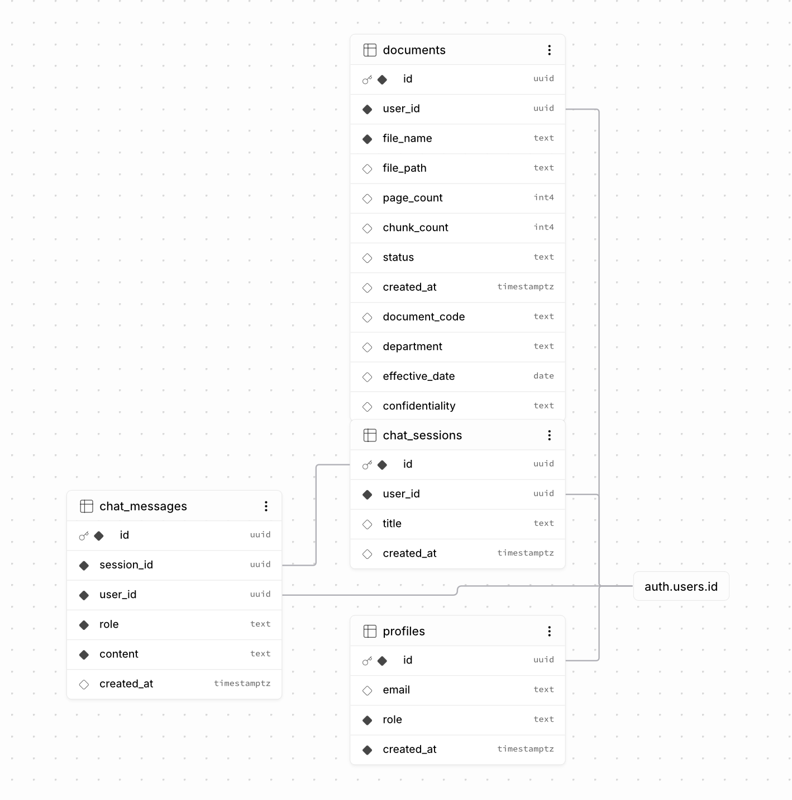

# 🤖 Enterprise GPT — AI Knowledge Assistant

<p align="center">
  <strong>Full-Stack Enterprise RAG Application for Secure Document Intelligence</strong>
</p>

<p align="center">
  Built with FastAPI • Next.js • LangChain • Google Gemini • OpenAI • ChromaDB • Supabase
</p>

<p align="center">
  <a href="https://enterprise-gpt-self.vercel.app">
    <strong>🚀 Live Application</strong>
  </a>
  &nbsp; | &nbsp;
  <a href="https://github.com/chandraAkiran/enterprise-gpt">
    <strong>💻 GitHub Repository</strong>
  </a>
</p>

---

## 📌 Project Overview

**Enterprise GPT** is a full-stack **AI-powered Enterprise Knowledge Assistant** that allows users to upload PDF documents and ask natural-language questions about their content.

The application uses **Retrieval-Augmented Generation (RAG)** to retrieve relevant information from uploaded documents and provide context-grounded responses using Large Language Models.

The system combines:

- 📄 PDF document ingestion
- ✂️ Intelligent text chunking
- 🧠 Vector embeddings
- 🔎 Semantic similarity search
- 🤖 Retrieval-Augmented Generation
- 🔗 LangChain Agents
- 🔀 Multi-LLM support
- 🔐 User authentication
- 👤 User-specific document retrieval
- 💬 Persistent chat sessions
- ⚡ Streaming AI responses
- 🗄️ Enterprise document metadata
- ☁️ Full-stack cloud deployment

The project demonstrates an end-to-end **Generative AI / RAG architecture**, from document ingestion to production deployment.

---

# 🌐 Live Application

### 🚀 Production Application

**Live Project:**  
https://enterprise-gpt-self.vercel.app

### 💻 Source Code

**GitHub Repository:**  
https://github.com/chandraAkiran/enterprise-gpt

---

# ☁️ Cloud Deployment

Enterprise GPT uses a decoupled frontend/backend deployment architecture.

| Component | Technology | Deployment |
|---|---|---|
| Frontend | Next.js + React + TypeScript | Vercel |
| Backend API | Python + FastAPI | Render |
| Database | PostgreSQL | Supabase |
| Authentication | Supabase Auth | Supabase |
| Document Storage | Supabase Storage | Supabase |
| Vector Database | ChromaDB | Backend |
| AI Framework | LangChain | Backend |
| LLM | Google Gemini / OpenAI | Cloud APIs |
| Embeddings | Gemini Embeddings | Google AI |

### Deployment Flow

```text
User Browser
     │
     ▼
┌──────────────────────────┐
│     Next.js Frontend     │
│                         │
│      Hosted on Vercel    │
└────────────┬─────────────┘
             │
             │ HTTPS / REST API
             ▼
┌──────────────────────────┐
│     FastAPI Backend      │
│                         │
│      Hosted on Render    │
└────────────┬─────────────┘
             │
     ┌───────┼───────────────┐
     │       │               │
     ▼       ▼               ▼
 Supabase  ChromaDB      LangChain
                             │
                             ▼
                     Gemini / OpenAI
```

---

# ✨ Key Features

## 📄 1. PDF Document Upload

Authenticated users can upload PDF documents to the application.

The backend:

1. Validates the uploaded file
2. Generates a unique document ID
3. Stores the PDF
4. Extracts text page-by-page
5. Splits the text into chunks
6. Generates vector embeddings
7. Stores embeddings in ChromaDB
8. Saves document metadata in Supabase

---

## 🧠 2. Retrieval-Augmented Generation

Enterprise GPT uses a complete **RAG pipeline** to answer questions based on uploaded enterprise documents.

Instead of relying only on the LLM's internal knowledge, the system retrieves relevant document chunks and provides them as context to the model.

This helps produce answers that are more relevant to the user's uploaded knowledge base.

---

## 🔎 3. Semantic Search

Uploaded documents are converted into vector embeddings.

When a user asks a question:

```text
User Question
      │
      ▼
Generate Query Embedding
      │
      ▼
ChromaDB Vector Search
      │
      ▼
Retrieve Top-K Relevant Chunks
      │
      ▼
Build Document Context
      │
      ▼
LLM
      │
      ▼
Context-Grounded Answer
```

The application retrieves the most relevant document chunks using semantic similarity.

---

## 🤖 4. Multi-LLM Support

The backend supports multiple LLM providers.

Current providers:

- Google Gemini
- OpenAI

The provider architecture makes it possible to select different models without redesigning the complete RAG pipeline.

---

## 🔗 5. LangChain Agents

Enterprise GPT includes **LangChain Agent** functionality.

The agent has access to a user-specific enterprise document search tool.

For enterprise-related questions, the agent can search uploaded documents before generating its response.

This architecture provides a foundation for future agentic workflows such as:

- Document search
- Policy lookup
- Report analysis
- Enterprise knowledge retrieval
- Workflow automation
- Multiple specialized tools

---

## 🔐 6. Secure Authentication

Authentication is implemented using **Supabase Auth**.

Users can:

- Create an account
- Sign in securely
- Access their own documents
- Maintain individual chat sessions
- Retrieve information from their own knowledge base

User IDs are used throughout the backend to associate application resources with authenticated users.

---

## 👤 7. User-Specific Knowledge Base

Document retrieval is scoped to the authenticated user.

Conceptually:

```text
User A
 ├── Document A1
 ├── Document A2
 └── Vector Embeddings A

User B
 ├── Document B1
 ├── Document B2
 └── Vector Embeddings B
```

This prevents the RAG pipeline from treating every uploaded document as one shared knowledge base.

---

## 💬 8. Persistent Chat Architecture

Enterprise GPT includes database tables for:

- Chat sessions
- Individual messages
- User association
- Message roles
- Conversation timestamps

This provides the foundation for maintaining persistent AI conversation history.

---

## ⚡ 9. Streaming AI Responses

The backend includes streaming support for AI-generated responses.

Streaming improves the user experience by allowing generated content to be delivered progressively rather than waiting for the entire response to complete.

---

## 🗄️ 10. Enterprise Document Metadata

Uploaded documents can contain additional enterprise metadata including:

- Document code
- Department
- Effective date
- Confidentiality level
- Processing status
- Page count
- Chunk count

This provides a foundation for advanced enterprise document governance and filtering.

---

# 🏗️ System Architecture

```text
                         ┌─────────────────────┐
                         │        USER         │
                         └──────────┬──────────┘
                                    │
                                    ▼
                    ┌─────────────────────────────┐
                    │      NEXT.JS FRONTEND       │
                    │                             │
                    │ React + TypeScript          │
                    │ Supabase Authentication     │
                    │                             │
                    │       Vercel Hosting        │
                    └──────────────┬──────────────┘
                                   │
                                   │ REST API
                                   ▼
                    ┌─────────────────────────────┐
                    │       FASTAPI BACKEND       │
                    │                             │
                    │ Python                      │
                    │ Authentication              │
                    │ Document Processing         │
                    │ RAG / Agents                │
                    │                             │
                    │        Render Hosting       │
                    └──────────────┬──────────────┘
                                   │
              ┌────────────────────┼────────────────────┐
              │                    │                    │
              ▼                    ▼                    ▼
      ┌───────────────┐    ┌───────────────┐    ┌───────────────┐
      │   SUPABASE    │    │   LANGCHAIN   │    │   CHROMADB    │
      │               │    │               │    │               │
      │ Authentication│    │ RAG Chains    │    │ Vector Store  │
      │ PostgreSQL    │    │ AI Agents     │    │ Semantic      │
      │ Storage       │    │ Tools         │    │ Search        │
      └───────────────┘    └───────┬───────┘    └───────┬───────┘
                                   │                    │
                                   └──────────┬─────────┘
                                              │
                                              ▼
                                  ┌───────────────────────┐
                                  │     LLM PROVIDERS     │
                                  │                       │
                                  │   Google Gemini       │
                                  │   OpenAI              │
                                  └───────────────────────┘
```

---

# 🗄️ Database ER Diagram

Enterprise GPT uses **Supabase PostgreSQL** to manage users, document metadata, chat sessions, and conversation history.

The database is integrated with **Supabase Authentication (`auth.users`)**, allowing application records to be associated with authenticated users.

<p align="center">
  
</p>

## Database Tables

### `profiles`

Stores application-level user information.

| Column | Type | Description |
|---|---|---|
| `id` | UUID | User identifier |
| `email` | Text | User email |
| `role` | Text | Application role |
| `created_at` | Timestamptz | Profile creation timestamp |

---

### `documents`

Stores uploaded document metadata.

| Column | Type | Description |
|---|---|---|
| `id` | UUID | Unique document ID |
| `user_id` | UUID | Document owner |
| `file_name` | Text | Original file name |
| `file_path` | Text | Storage path |
| `page_count` | Integer | Number of PDF pages |
| `chunk_count` | Integer | Number of generated chunks |
| `status` | Text | Document processing status |
| `created_at` | Timestamptz | Upload timestamp |
| `document_code` | Text | Enterprise document code |
| `department` | Text | Associated department |
| `effective_date` | Date | Document effective date |
| `confidentiality` | Text | Confidentiality classification |

---

### `chat_sessions`

Stores individual conversation sessions.

| Column | Type | Description |
|---|---|---|
| `id` | UUID | Session identifier |
| `user_id` | UUID | Session owner |
| `title` | Text | Conversation title |
| `created_at` | Timestamptz | Session creation time |

---

### `chat_messages`

Stores individual conversation messages.

| Column | Type | Description |
|---|---|---|
| `id` | UUID | Message identifier |
| `session_id` | UUID | Associated chat session |
| `user_id` | UUID | Associated user |
| `role` | Text | User/assistant role |
| `content` | Text | Message content |
| `created_at` | Timestamptz | Message timestamp |

---

## Database Relationships

```text
                    ┌─────────────────┐
                    │   auth.users    │
                    └────────┬────────┘
                             │
            ┌────────────────┼─────────────────┐
            │                │                 │
            ▼                ▼                 ▼
      ┌──────────┐     ┌───────────┐    ┌──────────────┐
      │ profiles │     │ documents │    │chat_sessions │
      └──────────┘     └───────────┘    └───────┬──────┘
                                                │
                                                │ session_id
                                                ▼
                                        ┌───────────────┐
                                        │ chat_messages │
                                        └───────────────┘
```

### Key Relationships

- `profiles.id` → `auth.users.id`
- `documents.user_id` → `auth.users.id`
- `chat_sessions.user_id` → `auth.users.id`
- `chat_messages.user_id` → `auth.users.id`
- `chat_messages.session_id` → `chat_sessions.id`

This database structure supports **authenticated users, document ownership, enterprise metadata, persistent chat sessions, and conversation history**.

---

# 🔄 RAG Pipeline

The core RAG workflow follows these stages:

```text
PDF Upload
    │
    ▼
PDF Text Extraction
    │
    ▼
Page Processing
    │
    ▼
Text Chunking
    │
    ▼
Gemini Embeddings
    │
    ▼
ChromaDB Vector Storage
    │
    ▼
────────────────────────
    USER QUESTION
────────────────────────
    │
    ▼
Question Embedding
    │
    ▼
Semantic Vector Search
    │
    ▼
Top-K Relevant Chunks
    │
    ▼
Context Construction
    │
    ▼
LangChain
    │
    ▼
Gemini / OpenAI
    │
    ▼
AI Response + Sources
```

---

# 📚 RAG Configuration

The backend uses configurable values for document processing and retrieval.

```python
CHUNK_SIZE = 1000
CHUNK_OVERLAP = 200
TOP_K = 5
```

### Embedding Model

```text
gemini-embedding-2
```

### Gemini Model

```text
gemini-3.6-flash
```

These values can be modified in the backend configuration depending on document size, retrieval requirements, and model availability.

---

# 🧰 Technology Stack

## Backend

| Technology | Purpose |
|---|---|
| Python | Backend programming |
| FastAPI | REST API development |
| Uvicorn | ASGI server |
| LangChain | RAG chains and agents |
| Google Gemini | LLM generation |
| OpenAI | Alternative LLM provider |
| ChromaDB | Vector database |
| PyPDF | PDF text extraction |
| Supabase | Authentication, DB and storage |

## Frontend

| Technology | Purpose |
|---|---|
| Next.js | Frontend framework |
| React | UI components |
| TypeScript | Type-safe development |
| Supabase JS | Authentication integration |
| Tailwind CSS | UI styling |

## Cloud & Infrastructure

| Platform | Purpose |
|---|---|
| Vercel | Frontend hosting |
| Render | Backend hosting |
| Supabase | PostgreSQL, authentication and storage |
| GitHub | Source control |

---

# 📁 Project Structure

```text
enterprise-gpt/
│
├── backend/
│   │
│   ├── ingestion/
│   │   ├── __init__.py
│   │   ├── chunker.py
│   │   └── pdf_loader.py
│   │
│   ├── llm/
│   │   ├── __init__.py
│   │   ├── openai_llm.py
│   │   └── provider.py
│   │
│   ├── rag/
│   │   ├── __init__.py
│   │   ├── agent.py
│   │   ├── agent_tools.py
│   │   ├── embeddings.py
│   │   ├── langchain_chain.py
│   │   ├── langchain_llm.py
│   │   ├── rag_engine.py
│   │   └── vector_store.py
│   │
│   ├── auth.py
│   ├── config.py
│   ├── main.py
│   └── requirements.txt
│
├── frontend/
│   │
│   ├── app/
│   │   ├── admin/
│   │   ├── chat/
│   │   ├── dashboard/
│   │   ├── documents/
│   │   ├── login/
│   │   ├── signup/
│   │   ├── globals.css
│   │   ├── layout.tsx
│   │   └── page.tsx
│   │
│   ├── components/
│   ├── lib/
│   ├── public/
│   ├── package.json
│   ├── next.config.ts
│   └── tsconfig.json
│
├── docs/
│   └── enterprise-gpt-er-diagram.png
│
├── .gitignore
└── README.md
```

---

# ⚙️ Local Installation

## Prerequisites

Make sure the following are installed:

- Python 3.10+
- Node.js
- npm
- Git

You will also need:

- Supabase project
- Google Gemini API key
- OpenAI API key if using OpenAI

---

# 1️⃣ Clone the Repository

```bash
git clone https://github.com/chandraAkiran/enterprise-gpt.git

cd enterprise-gpt
```

---

# 2️⃣ Backend Setup

Navigate to the backend:

```bash
cd backend
```

Create a virtual environment:

### macOS / Linux

```bash
python3 -m venv venv
source venv/bin/activate
```

### Windows

```bash
python -m venv venv
venv\Scripts\activate
```

Install dependencies:

```bash
pip install -r requirements.txt
```

---

# 3️⃣ Backend Environment Variables

Create:

```text
backend/.env
```

Add the required environment variables:

```env
GEMINI_API_KEY=your_gemini_api_key

OPENAI_API_KEY=your_openai_api_key

SUPABASE_URL=your_supabase_project_url

SUPABASE_SECRET_KEY=your_supabase_secret_key
```

> ⚠️ Never commit API keys, Supabase secret keys, or other credentials to GitHub.

---

# 4️⃣ Start the Backend

From the `backend` directory:

```bash
uvicorn main:app --reload
```

The local API will normally run at:

```text
http://127.0.0.1:8000
```

Check the API:

```text
http://127.0.0.1:8000/health
```

FastAPI documentation:

```text
http://127.0.0.1:8000/docs
```

---

# 5️⃣ Frontend Setup

Open another terminal:

```bash
cd frontend
```

Install dependencies:

```bash
npm install
```

---

# 6️⃣ Frontend Environment Variables

Create:

```text
frontend/.env.local
```

Configure the Supabase and backend environment variables required by the frontend.

Example:

```env
NEXT_PUBLIC_SUPABASE_URL=your_supabase_url

NEXT_PUBLIC_SUPABASE_ANON_KEY=your_supabase_anon_key

NEXT_PUBLIC_API_URL=http://127.0.0.1:8000
```

Use your production backend URL instead of localhost when deploying the frontend.

---

# 7️⃣ Start the Frontend

```bash
npm run dev
```

Open:

```text
http://localhost:3000
```

---

# 🔌 API Overview

The FastAPI backend provides endpoints for the major application workflows.

## Health Check

```http
GET /health
```

Example response:

```json
{
  "status": "healthy"
}
```

---

## Document Upload

Authenticated users can upload PDF documents.

```http
POST /upload
```

The upload pipeline:

```text
PDF
 ↓
Validation
 ↓
Supabase Storage
 ↓
Text Extraction
 ↓
Chunking
 ↓
Embeddings
 ↓
ChromaDB
 ↓
Document Metadata
```

---

# 🔐 Security Architecture

Enterprise GPT is designed around authenticated, user-specific access.

```text
Login
  │
  ▼
Supabase Auth
  │
  ▼
Access Token
  │
  ▼
Next.js Frontend
  │
  ▼
FastAPI
  │
  ▼
Validate User
  │
  ├── Documents
  ├── Chat Sessions
  ├── Chat Messages
  └── User-Specific Vector Search
```

Security-related design principles include:

- Authenticated API access
- User-associated documents
- User-specific vector retrieval
- Environment-based secret management
- Separation of frontend and backend credentials
- Supabase authentication
- Controlled document access

---

# 📖 Example Use Case

Imagine an organization uploads an internal policy document.

### Uploaded document

```text
Employee Leave Policy.pdf
```

The user can ask:

```text
How many annual leave days are employees entitled to?
```

The application:

1. Converts the question into an embedding
2. Searches the user's ChromaDB knowledge base
3. Retrieves the most relevant sections
4. Builds document context
5. Sends the context and question to the selected LLM
6. Generates a grounded answer
7. Returns relevant source information

This allows employees to query large internal documents using natural language.

---

# 🎯 Problems Solved

Enterprise GPT addresses several common enterprise knowledge-management challenges:

### Information Retrieval

Employees often spend significant time searching large documents manually.

Enterprise GPT enables natural-language document search.

### LLM Hallucination

Generic LLMs may generate information that is not present in company documents.

RAG provides retrieved enterprise context to improve grounding.

### Document Organization

Document metadata allows enterprise files to be classified by:

- Department
- Document code
- Effective date
- Confidentiality

### Conversation Continuity

Chat sessions and messages provide a database foundation for persistent conversation history.

### Multi-Model Flexibility

The provider architecture allows the application to support more than one LLM.

---

# 🧪 Example RAG Workflow

```text
Question:
"What is the company's remote work policy?"

            │
            ▼

Generate Question Embedding

            │
            ▼

Search User's ChromaDB Collection

            │
            ▼

Retrieve Relevant Policy Chunks

            │
            ▼

Construct Prompt

Context:
[Relevant policy sections]

Question:
"What is the company's remote work policy?"

            │
            ▼

Gemini / OpenAI

            │
            ▼

Grounded AI Response
+
Document Sources
```

---

# 🧠 Skills Demonstrated

This project demonstrates practical experience with:

### Generative AI

- Large Language Models
- Google Gemini
- OpenAI
- Prompt engineering
- Context-grounded generation

### Retrieval-Augmented Generation

- Document ingestion
- Chunking strategies
- Vector embeddings
- Semantic retrieval
- Context construction
- Source-aware responses

### AI Agents

- LangChain
- Tool-enabled agents
- User-specific document search
- Agent orchestration

### Backend Engineering

- Python
- FastAPI
- REST APIs
- Authentication
- Streaming responses
- Modular application architecture

### Database Engineering

- PostgreSQL
- Relational database design
- UUID relationships
- Document metadata
- Chat persistence

### Vector Databases

- ChromaDB
- Embedding storage
- Similarity search
- User-specific retrieval

### Frontend Development

- Next.js
- React
- TypeScript
- Authentication flows
- API integration

### Cloud Deployment

- Vercel
- Render
- Supabase
- Environment variables
- Full-stack deployment

---

# 🚀 Future Improvements

Potential future enhancements include:

- [ ] Hybrid semantic + keyword search
- [ ] Reranking retrieved chunks
- [ ] Support for DOCX, TXT and CSV files
- [ ] OCR support for scanned PDFs
- [ ] Advanced metadata filtering
- [ ] Conversation memory improvements
- [ ] More LLM providers
- [ ] Advanced role-based access control
- [ ] Team and organization workspaces
- [ ] Document versioning
- [ ] Usage analytics
- [ ] RAG evaluation framework
- [ ] Automated hallucination evaluation
- [ ] Docker deployment
- [ ] CI/CD pipeline
- [ ] Cloud vector database support
- [ ] Voice interaction

---

# 💼 Resume-Ready Project Description

## Enterprise GPT — AI Knowledge Assistant

**Tech Stack:** Python, FastAPI, Next.js, React, TypeScript, LangChain, Google Gemini, OpenAI, ChromaDB, Supabase, PostgreSQL, Vercel, Render

Built and deployed a **full-stack Enterprise AI Knowledge Assistant** using Retrieval-Augmented Generation (RAG), LangChain Agents, Gemini/OpenAI LLMs, ChromaDB, Supabase, FastAPI, and Next.js.

Developed an end-to-end document intelligence pipeline supporting **PDF ingestion, text extraction, document chunking, vector embeddings, semantic search, context-grounded question answering, source retrieval, multi-LLM selection, secure authentication, user-specific document retrieval, and streaming AI responses**.

Designed a relational database architecture for **user profiles, enterprise document metadata, chat sessions, and conversation history**, integrated with Supabase Authentication.

Deployed the **Next.js frontend on Vercel** and the **FastAPI backend on Render**.

---

# 📄 Resume Bullet Points

- Built a full-stack **RAG-based Enterprise AI Knowledge Assistant** using Python, FastAPI, Next.js, LangChain, Gemini, OpenAI, ChromaDB and Supabase.
- Developed an end-to-end **PDF ingestion and semantic retrieval pipeline** using text chunking, Gemini embeddings, ChromaDB vector search and context-grounded LLM generation.
- Implemented **LangChain agents and multi-LLM support** for Gemini and OpenAI with user-specific enterprise document retrieval.
- Integrated **Supabase Authentication, PostgreSQL and Storage** for secure user access, document metadata, chat sessions and file management.
- Designed a relational database schema supporting **users, enterprise documents, chat sessions and persistent conversation history**.
- Deployed the production **Next.js frontend on Vercel** and **FastAPI backend on Render**.

---

# 🔗 Project Links

### 🚀 Live Application

https://enterprise-gpt-self.vercel.app

### 💻 GitHub Repository

https://github.com/chandraAkiran/enterprise-gpt

---

# 👨‍💻 Author

## Chandra Akash Kiran

**M.Tech in Computer Science**

Interested in:

- Data Science
- Machine Learning
- Generative AI
- Retrieval-Augmented Generation
- LLM Applications
- AI Engineering

### GitHub

https://github.com/chandraAkiran

### Project Repository

https://github.com/chandraAkiran/enterprise-gpt

### Live Project

https://enterprise-gpt-self.vercel.app

---

## ⭐ Support

If you find this project useful or interesting, consider giving the repository a **⭐ star**.

---

<p align="center">
  <strong>Built with Python, FastAPI, Next.js, LangChain, Gemini, OpenAI, ChromaDB and Supabase</strong>
</p>
